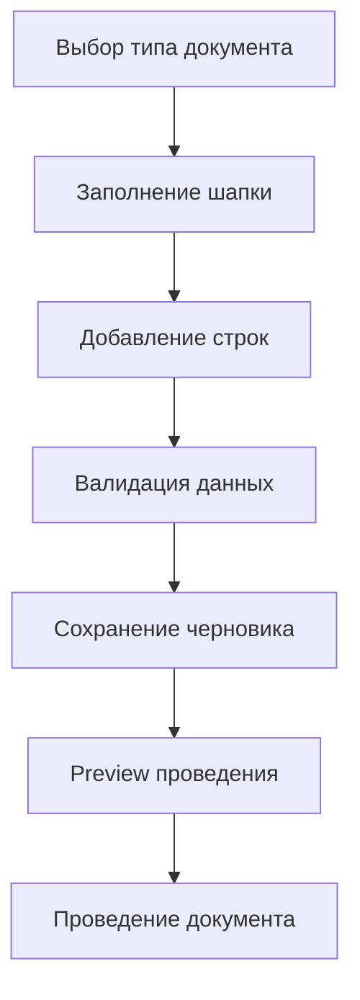
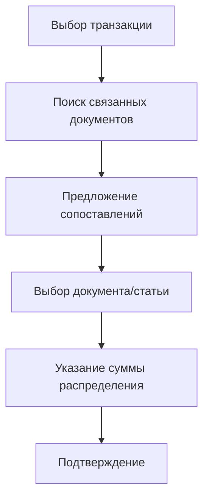

# Основные пользовательские сценарии

## Сценарии использования

### 1. Создание предприятия

**Цель:** Начать работу с новым предприятием

**Шаги:**
1. Выбор страны (UA, AT, DE, etc.)
2. Выбор шаблона предприятия (ФОП, ООО, Einzelunternehmer, GmbH)
3. Ввод базовой информации (название, валюта)
4. Создание предприятия с предустановленной конфигурацией

**UI требования:**
- Мастер настройки (wizard)
- Прогрессивное раскрытие опций
- Валидация на каждом шаге
- Возможность вернуться и изменить

### 2. Ежедневная работа бухгалтера

**Цель:** Обычный рабочий день бухгалтера

**Шаги:**
1. **Проверка уведомлений** - новые задачи, предупреждения
2. **Загрузка банковских выписок** - импорт и автоматическое сопоставление
3. **Создание документов** - поступления, продажи, расходы
4. **Проведение документов** - с preview эффектов
5. **Проверка остатков** - склад, финансы
6. **Закрытие дня** - если требуется

**UI требования:**
- Дашборд с задачами и метриками
- Быстрый доступ к частым операциям
- Нотификации о важных событиях

### 3. Инвентаризация склада

**Цель:** Провести инвентаризацию товаров

**Шаги:**
1. Создание сессии инвентаризации
2. Выбор точки учета (склад, магазин)
3. Подсчет товаров (оффлайн/онлайн)
4. Ввод результатов подсчета
5. Проверка и корректировка
6. Подтверждение результатов

**UI требования:**
- Поддержка оффлайн режима
- Штрихкоды/QR коды для быстрого ввода
- Валидация подсчета
- Preview корректировок

### 4. Управление заказами

**Цель:** Обработать заказ от клиента

**Шаги:**
1. Получение заказа (импорт/ручной ввод)
2. Проверка наличия товаров
3. Создание резерва под заказ
4. Выставление счета
5. Отгрузка (проведение расхода)
6. Конвертация резерва

**UI требования:**
- Интеграция с CRM/магазином
- Автоматическая проверка остатков
- Workflow статусов заказа

### 5. Закрытие периода

**Цель:** Завершить учетный период

**Шаги:**
1. Проверка всех проведенных документов
2. Запуск регулярных операций (амортизация)
3. Формирование отчетности
4. Проверка баланса
5. Закрытие периода

**UI требования:**
- Чек-лист обязательных шагов
- Прогресс-бар выполнения
- Предупреждения о незавершенных операциях

## Детальные workflows

### Документооборот

#### Создание документа

#### Проведение документа
1. **Pre-checks:**
   - Период открыт
   - Права доступа
   - Валидация данных

2. **Preview:**
   - Расчет всех эффектов
   - Показ изменений
   - Предупреждения

3. **Post:**
   - Атомарное проведение
   - Создание проводок
   - Обновление остатков

### Банковская сверка

#### Импорт выписки
1. **Выбор файла** (CSV, Excel, PDF)
2. **Парсинг** с учетом формата банка
3. **Дедупликация** по external_id
4. **Автосопоставление:**
   - По сумме и дате
   - По контрагенту
   - По номеру документа

5. **Ручная проверка** нераспознанных транзакций
6. **Массовое распределение** или индивидуальное

#### Распределение платежа

### Складские операции

#### Резерв под заказ
1. **Проверка доступности** товара
2. **Создание резерва** с TTL
3. **Блокировка остатка**
4. **Отслеживание статуса** резерва

#### Конвертация резерва
1. **Связывание** с документом отгрузки
2. **Проверка** соответствия количества
3. **Атомарная операция** через Posting Orchestrator
4. **Освобождение/уменьшение** резерва

### Регулярные операции

#### Настройка регулярной операции
1. **Выбор типа** (амортизация, распределение расходов)
2. **Настройка расписания** (ежемесячно, ежеквартально)
3. **Определение правил** расчета
4. **Тестирование** на исторических данных

#### Запуск регулярной операции
1. **Preview** результатов
2. **Проверка** на ошибки
3. **Массовое проведение**
4. **Журналирование** запуска

## UX паттерны

### Мастера (Wizards)
- **Шаги:** четкие, нумерованные
- **Progress:** показывать текущий шаг
- **Navigation:** возможность вернуться
- **Save:** черновики для сложных процессов

### Списки с действиями
- **Фильтры:** быстрый поиск и фильтрация
- **Bulk actions:** массовые операции
- **Pagination:** эффективная навигация
- **Sort:** по релевантным полям

### Формы
- **Validation:** real-time валидация
- **Auto-save:** для длинных форм
- **Templates:** предустановленные шаблоны
- **Import:** из Excel/CSV

### Асинхронные операции
- **Progress:** показывать статус
- **Notifications:** оповещения о завершении
- **Retry:** возможность повторить при ошибке
- **Cancel:** отмена длительных операций

## Обработка ошибок

### Типы ошибок
- **Validation:** показывать рядом с полем
- **Business logic:** модальные окна с объяснением
- **System:** graceful degradation с retry

### Recovery
- **Auto-retry:** для сетевых ошибок
- **Manual retry:** с объяснением
- **Data preservation:** не терять введенные данные

## Мобильная адаптивность

### Touch-friendly интерфейс
- Большие кнопки (минимум 44px)
- Swipe жесты для действий
- Карточный вид для списков

### Оффлайн режим
- Кеширование данных
- Очередь операций
- Синхронизация при подключении

## Интеграции

### Внешние системы
- **CRM:** синхронизация клиентов
- **Магазины:** импорт заказов
- **Банки:** автоматический импорт выписок
- **Склады:** синхронизация остатков

### API-first подход
- Все операции доступны через API
- Webhooks для автоматизации
- Programmatic access для интеграций